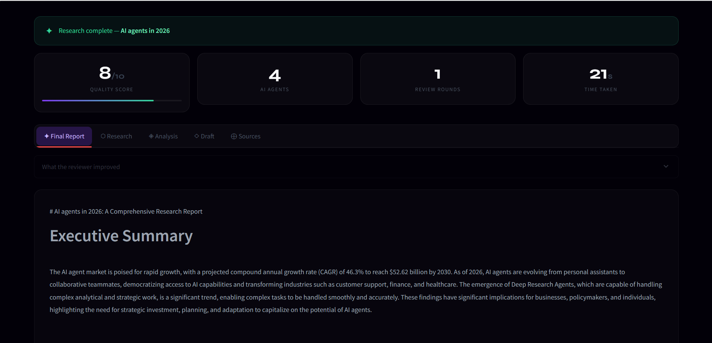
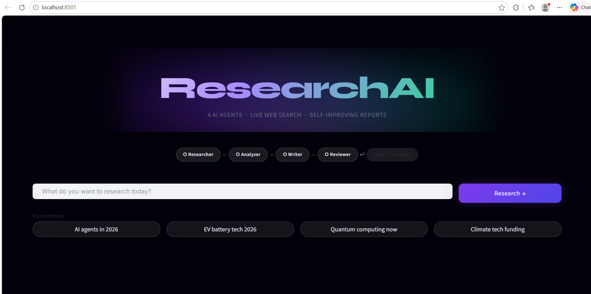
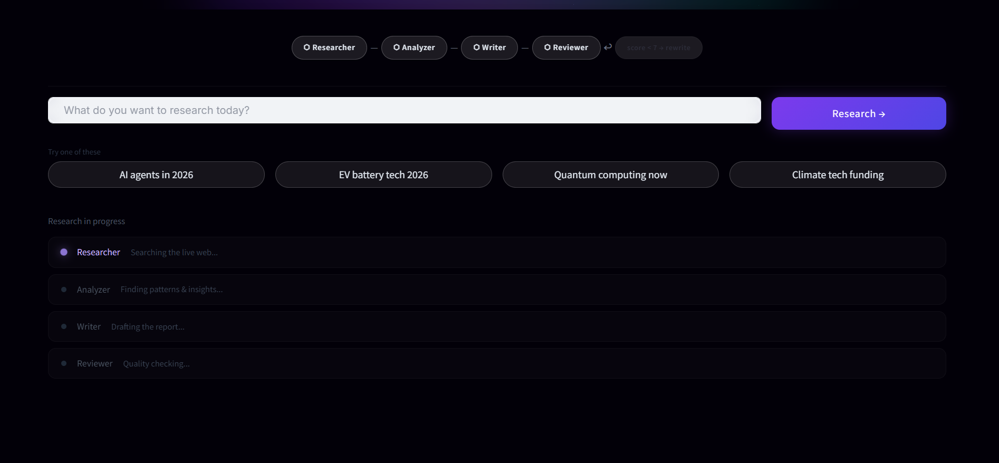
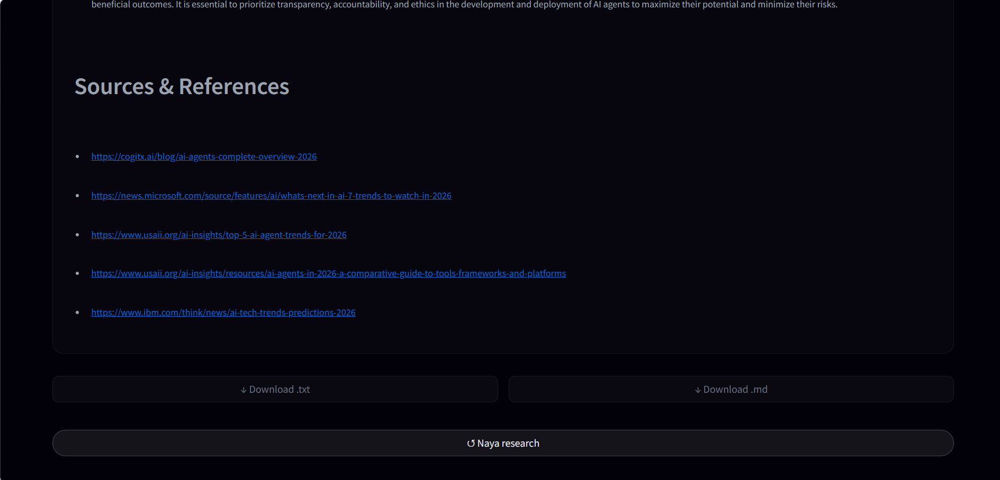

# ResearchAI 🔬
> Enter any topic. Get a full structured research report — written, reviewed, and self-improved by 4 AI agents.



👉 [**Try the live app →**](https://research-ai-txusrtrkakifrcnmzozwsn.streamlit.app/)

---

## What it does

You type a topic. Four AI agents take over automatically:

| Agent | What it does |
|---|---|
| 🔍 Researcher | Searches the live internet using Tavily |
| 🧠 Analyzer | Extracts insights, patterns, and SWOT analysis |
| ✍️ Writer | Writes a 7-section structured report |
| ✅ Reviewer | Scores the report 1–10. If score < 7, sends it back for rewriting |

The feedback loop is the key feature — the system improves its own output until quality passes the threshold.

---

## Screenshots

| Input | Agents Running | Final Report | Sources |
|---|---|---|---||---|---|---|
|  |  |  |  |
---

## Tech Stack

| Tool | Purpose |
|---|---|
| LangGraph | Agent orchestration + feedback loop |
| Groq (Llama 3.3 70B) | LLM for all 4 agents |
| Tavily | Real-time web search |
| FastAPI | REST API backend |
| Streamlit | Frontend UI |

---

## What makes this different from a basic chatbot

- **Real web search** — agents read the actual internet, not LLM memory
- **Self-improving output** — reviewer scores quality and triggers rewrites automatically
- **Source transparency** — every web source used is shown in the final report
- **Export** — download the final report as `.txt` or `.md`

---

## Project Structure

research-ai/
├── app/
│   ├── agents/
│   │   ├── researcher.py   # Tavily search agent
│   │   ├── analyzer.py     # Insight extraction
│   │   ├── writer.py       # Report generation
│   │   └── reviewer.py     # Quality scoring + feedback
│   ├── tools/
│   │   └── search.py
│   ├── config.py
│   └── graph.py            # LangGraph pipeline
├── main.py                 # FastAPI backend
├── streamlit_app.py        # Streamlit frontend
├── requirements.txt
├── .env.example
└── screenshots/

---

## Local Setup

### 1. Clone the repo
```bash
git clone https://github.com/SRASHTI2004/RESEARCH-AI.git
cd RESEARCH-AI
```

### 2. Create virtual environment
```bash
python -m venv venv

# Windows
venv\Scripts\activate

# Mac/Linux
source venv/bin/activate
```

### 3. Install dependencies
```bash
pip install -r requirements.txt
```

### 4. Add API keys
```bash
cp .env.example .env
```
Open `.env` and fill in:

GROQ_API_KEY=your_key_here      # free at console.groq.com
TAVILY_API_KEY=your_key_here    # free at app.tavily.com

### 5. Run the app
```bash
# Terminal 1 — Backend
uvicorn main:app --reload

# Terminal 2 — Frontend
streamlit run streamlit_app.py
```
Open browser → http://localhost:8501

---

## Built by

**Srashti Choudhary** — Final Year IT Student @ MAIT, Delhi  
Aspiring AI/Backend Engineer

[](https://www.linkedin.com/in/srashti-choudhary)
[](https://github.com/SRASHTI2004)
