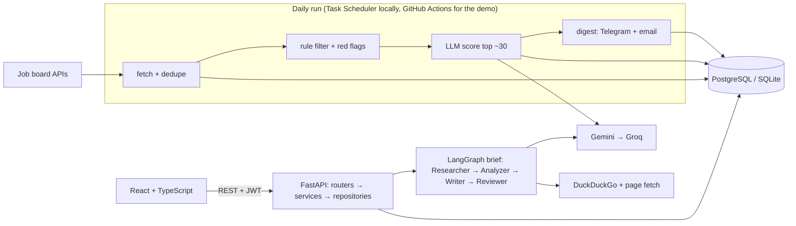

# ResearchAI

**A job-search assistant for fresher developers: daily matches from public job APIs, scored by an LLM
against your profile, plus an application tracker, honest resume tailoring and cited company briefs.**
It never scrapes LinkedIn/Naukri/Indeed, never auto-applies, and never sends a message for you.

**[Live demo](https://researchai-web.onrender.com)** · click *Try the demo* (the free backend may take ~1-2 min to wake up)


Everything runs on free tiers and fits an **8 GB laptop**: rule filters before any LLM call,
free-tier LLMs (Gemini primary, Groq fallback), and a deployment that peaks at 170 MB on
Render's 512 MB free plan.


<table>
  <tr>
    <td width="50%"></td>
    <td width="50%"></td>
  </tr>
  <tr>
    <td></td>
    <td></td>
  </tr>
  <tr>
    <td></td>
    <td></td>
  </tr>
</table>

<sub>Screenshots are taken from the live deployment, signed in as the demo account (real postings
fetched by the app, sample tracker entries).</sub>

---

## What it does

- **Job sourcing.** Greenhouse, Lever and Ashby board APIs for the companies in
  `config/companies.yaml`, plus Remotive, Remote OK, We Work Remotely (RSS), Himalayas, Arbeitnow
  and Adzuna India (optional key). I checked each source's API terms before using it. Postings are
  normalised and de-duplicated, and an official board wins over an aggregator copy.
- **Rule filter** (`app/services/job_filter.py`). Free and fast. It drops senior and level-2+ titles,
  non-development roles, postings asking for more experience than the profile allows, and locations
  outside India or worldwide remote. When unsure, it keeps the job.
- **LLM scoring** (`app/services/scoring_service.py`). Only the rule-ranked top ~30 per run are sent
  to the model, in batches, paced for free-tier limits. Each job gets a 0–100 fit score, a one-line
  reason and a "fresher-friendly" flag. Gemini is the primary model, with Groq as fallback.
- **Red flags** (`app/services/genuineness.py`). Fees, Telegram/WhatsApp-only contact, personal
  email domains, unrealistic pay. These are shown as "check this", never as a verdict.
- **Daily digest.** The top 10 new matches go to Telegram and an HTML email. The two channels are
  independent, so one failing doesn't stop the other.
- **Application tracker.** Statuses run saved → applied → referral asked → interview →
  rejected/offer, with notes and follow-up reminders.
- **Referral helper.** LinkedIn search strings to paste yourself, a where-to-look checklist and message
  drafts. There is no LinkedIn automation.
- **Resume tailoring.** Reorders and rewords your real master resume for one posting. A validator
  rejects any rewrite that introduces a number, tool or name that isn't in the original. You get a
  diff and an ATS-friendly PDF/DOCX.
- **Company research brief.** A four-stage LangGraph pipeline: Researcher (web search and page
  extraction, numbered citations), Analyzer, Writer, then a Reviewer that lists uncited claims. Each
  stage is saved as it finishes, so the UI shows progress.

## How it fits together


```mermaid
flowchart LR
    subgraph Daily["Daily run (Task Scheduler locally, GitHub Actions for the demo)"]
        Fetch["fetch + dedupe"] --> Filter["rule filter + red flags"] --> Score["LLM score top ~30"] --> Digest["digest: Telegram + email"]
    end
    Sources["Job board APIs"] --> Fetch
    Score --> LLM["Gemini → Groq"]
    UI["React + TypeScript"] -->|"REST + JWT"| API["FastAPI: routers → services → repositories"]
    API --> DB[("PostgreSQL / SQLite")]
    Fetch & Score & Digest --> DB
    API --> Brief["LangGraph brief: Researcher → Analyzer → Writer → Reviewer"]
    Brief --> LLM
    Brief --> Web["DuckDuckGo + page fetch"]
```

The backend is layered: routers handle HTTP only, services hold the logic, and repositories own the
queries. Settings come from environment variables (`app/core/config.py`). The same code runs on SQLite
locally and on Postgres in production, with only `DATABASE_URL` changing. Briefs run through a Celery
task, in-process by default, or on a real worker with Redis via `docker compose`.

## Evaluation

`python -m evaluation.run` measures each stage against a hand-labelled test set: 120 real postings
fetched by the app on 2026-10-06 and labelled against the public example profile (fresher full-stack
developer, Python/React, India or worldwide remote). The set is **enriched for hard cases**: every
posting the filter kept, plus its near-misses. Relevant postings are well under 1% of what the
sources return, so a random sample would contain almost none. With only 11 relevant postings, each
one moves recall by about 9 points, so treat these numbers as rough. The labelling rubric and
sampling are described in [`evaluation/README.md`](evaluation/README.md); raw results are in
[`evaluation/results/latest.json`](evaluation/results/latest.json).

| Stage | Metric | Result |
|---|---|---|
| Rule filter | recall (relevant postings kept) | 81.8% (9 of 11) |
| Rule filter | precision (kept postings that are relevant) | 26.5% (9 of 34) |
| Rule filter | postings rejected before any LLM call (all 3,702 fetched that day) | 98.9% |
| LLM scorer | AUC on filter survivors, 3 runs | 0.85 (0.83–0.87) |
| LLM scorer | precision of jobs scored 50 or more | 68% (50–80%) |
| Digest | relevant jobs in the top 10 | 66% (60–70%) |
| Digest | share of all relevant jobs that reach the top 10 | 58% (55–64%) |
| Red flags | false alarms on 126 legitimate postings | 2 (1.6%) |

LLM scoring used `gemini-flash-lite-latest` at temperature 0.1. Ranges show the spread across 3
repeated runs.

What the numbers say:

- **The filter is tuned for recall, and pays in precision on purpose.** It removes ~99% of fetched
  postings for free, so the rate-limited LLM only sees a few dozen a day.
- **Both filter misses had a location field ("United States") that contradicted the description**
  ("India-based", "work from anywhere"). The filter trusts the structured field.
- **The LLM ranks well, but the digest still misses ~40% of relevant jobs.** Two misses come from the
  filter. The rest are relevant jobs the model read as too demanding for a fresher: "you have shipped
  Python to production" scored 35, "1+ years on distributed systems" scored 15. Some also fell off a
  tie at the score-40 cut-off.
- **The scorer caught a labelling mistake.** It flagged a "2027 graduates only" restriction that I
  had missed in two postings. I verified this against the text and corrected the labels.
- **Red flags can only be judged for false alarms here.** None of the postings in the set is a scam,
  so the set can't measure how many real scams the flags catch.

**Company briefs.** I ran 4 briefs (`python -m evaluation.run --briefs HackerRank Stripe Rubrik Plane`)
on `gemini-flash-lite-latest`. The checks are computed in code from the final report, not taken from
the Reviewer agent's verdict.

| Metric | Result |
|---|---|
| completed | 4 of 4, 52 s on average, 7 sources each |
| factual lines carrying a citation (HackerRank, Stripe, Rubrik) | 95% (78 of 82) |
| citations pointing at a source that doesn't exist | 0 of 205 |

The uncited lines are mostly interview-prep suggestions ("candidates should expect…") rather than
facts about the company. The Plane brief shows the limits of these checks. The web search returned
other things named "Plane", and the brief correctly says its sources don't cover the company, yet it
still scores 100% on citation coverage, because every line cites something. A structural check can't
tell a well-sourced brief from a confidently-cited "we found nothing".

## Running it locally

Prerequisites: Python 3.12 and Node.js 20+. The commands are for Windows PowerShell.

```powershell
# backend
python -m venv venv; venv\Scripts\activate
pip install -r requirements-dev.txt
copy .env.example .env      # then set SECRET_KEY, GEMINI_API_KEY (free), GROQ_API_KEY (free)
alembic upgrade head
uvicorn app.main:app --reload               # API docs at http://127.0.0.1:8000/docs

# frontend (second terminal)
cd frontend; npm install; copy .env.example .env
npm run dev                                 # http://localhost:5173
```

Generate a `SECRET_KEY` with `python -c "import secrets; print(secrets.token_urlsafe(32))"`. Free keys:
Gemini at https://aistudio.google.com/apikey and Groq at https://console.groq.com.

Your personal files are git-ignored, and `scripts/check_forbidden_files.py` blocks them in pre-commit
and CI:

| File | Copy from | Contents |
|---|---|---|
| `.env` | `.env.example` | secrets and settings |
| `config/profile.yaml` | `config/profile.example.yaml` | skills, target roles, cities (used by the filter, scorer and referral helper) |
| `data/private/master_resume.yaml` | `data/master_resume.example.yaml` | your real experience; the tailor can only reorder and reword it |

Daily use:

```powershell
python -m app.cli run-daily       # fetch -> score -> digest
python -m app.cli test-digest     # sends a sample digest to each configured channel
powershell -ExecutionPolicy Bypass -File scripts\register_daily_task.ps1   # schedule 09:00 daily
```

For the digest, set `TELEGRAM_BOT_TOKEN`/`TELEGRAM_CHAT_ID` (create a bot with @BotFather) and/or
Gmail SMTP with an App Password in `.env`. Each setting is commented in `.env.example`.

## Deployment

The public demo runs entirely on free plans, none of which needs a payment card:

- **Render**: the API as a Docker web service and the frontend as a static site, both defined in
  [`render.yaml`](render.yaml).
- **Neon**: Postgres. Render's free disk is wiped on restart, and its free Postgres expires after 30
  days.
- **GitHub Actions**: the daily fetch and score ([`daily-jobs.yml`](.github/workflows/daily-jobs.yml)),
  because Render's free plan has no cron.

Three settings keep a shared free-tier LLM quota from running out:

- `REGISTRATION_ENABLED=false`: no self-serve sign-up.
- `DEMO_ENABLED=true`: one-click demo account. Its data resets on every start (`python -m app.cli seed-demo`).
- `LLM_DAILY_ACTION_LIMIT=8`: company briefs plus LLM resume tailoring, per 24 hours across all visitors.

The demo runs briefs on `gemini-flash-lite-latest`. Its free daily quota is much larger than
`gemini-flash-latest`'s (about 20 requests a day), and the brief evaluation above was run on it.

Memory, measured in the production image under Render's free-plan limits (512 MB, 0.1 CPU,
Postgres 16): 148 MB idle, and 170 MB peak during resume tailoring, PDF/DOCX export and a brief run.
Cold start is about 100 seconds at 0.1 CPU.

## Tests and checks

```powershell
pytest                                     # 252 tests; every external API, LLM, Telegram and SMTP call is mocked
ruff check app tests scripts evaluation; mypy app tests evaluation
cd frontend; npm run test; npm run lint; npm run build    # 61 tests
```

CI runs all of these on every push, plus the forbidden-files check.

## Known limitations

- **Free-tier LLM quotas shape everything.** A brief takes four LLM calls. `gemini-flash-latest`
  allows only about 20 a day on the free tier, and Groq's 8,000 tokens/minute is too small for the
  Researcher prompt. So the demo uses the lighter Gemini model, caps AI actions at 8 per day, and
  briefs fail once Gemini's daily quota is gone.
- **Ambiguous company names produce empty briefs.** Search has no disambiguation: "Plane" returned
  other companies, and the brief (correctly) reported that it found nothing.
- **Only sources with a public API.** Many Indian companies post only on LinkedIn or Naukri, which
  this deliberately doesn't touch.
- **Known filter misses** (from the evaluation):
  - It takes the smallest "N years" figure in a posting, so "4+ years of Go … 2+ years on auth"
    passes.
  - It misses "(at least 8 years)" when "experience" comes before the number.
  - It trusts the structured location field even when the description contradicts it.

  The LLM scorer catches the first two, scoring those jobs 20 and 10.
- **Scores and red flags are heuristics.** Always check the company's own site.
- **Citation checks are structural.** They confirm that each claim has a `[n]` pointing at a real
  source, not that the source supports the claim.
- **The digest is single-user.** It goes to whoever runs the install. The demo has no digest.
- **Not verified end to end:** real Telegram/Gmail delivery (needs personal credentials), and the
  MinIO export path in `docker compose`.

## Project structure

```
app/
  api/routers/     auth, jobs (+ referral, brief), applications, resumes, research, health
  core/            config, security, llm/, search, jobsources/, notify, profile, resume, storage
  services/        filter, genuineness, ingest, scoring, digest, daily, referral, resume_*, research,
                   demo, usage
  repositories/    database access
  pipeline/        LangGraph research agents
  worker/          Celery app + research task
  demo/            demo-account fixtures (real postings, sample tracker)
  cli.py           fetch | refilter | sources | score | digest | test-digest | run-daily | seed-demo
evaluation/        test set, labelling rubric, evaluation script and results
frontend/src/      pages, components (shadcn/ui-style), API client, auth, theme
docs/DECISIONS.md  why each technical choice was made, phase by phase
```

## Author

**Srashti Choudhary** · [github.com/SRASHTI2004](https://github.com/SRASHTI2004)
