# ResearchAI — Job Search Assistant + Company Research Briefs

A personal job-search assistant for a fresher full-stack developer. Every day it pulls new postings
from **legal, free job APIs**, filters and scores them against your profile, flags possible scams, and
sends you the top matches on **Telegram and email**. In the web app you track applications, get help
asking for referrals, tailor your resume to a posting (without inventing anything), and generate a
cited **Company Research Brief** for any job's company.

It never scrapes LinkedIn/Naukri/Indeed, never auto-applies, and never sends a message for you.

See [`docs/DECISIONS.md`](docs/DECISIONS.md) for the phase-by-phase engineering log,


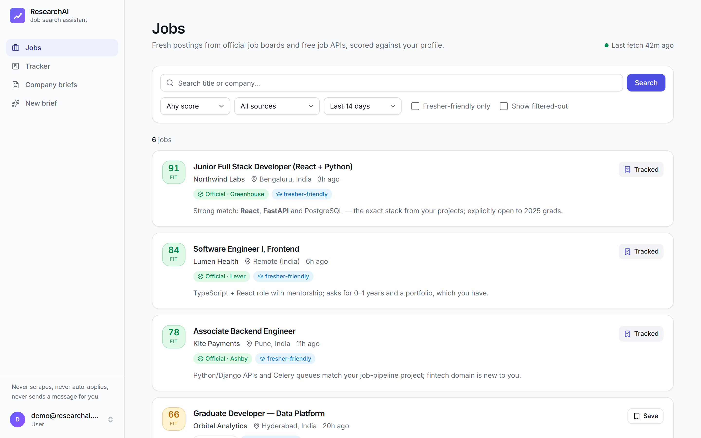

## What it does

| Feature | Where | How |
|---|---|---|
| **Job sourcing** | `app/core/jobsources/` | Greenhouse, Lever and Ashby public board APIs for the companies in `config/companies.yaml`, plus Remotive, Remote OK, We Work Remotely (RSS), Himalayas, Arbeitnow and Adzuna India (optional key). Each source's API and terms were checked before use — see `docs/DECISIONS.md`. Jobs are normalized, deduped (official boards win over aggregators) and stored with `first_seen_at` / `last_seen_at`. |
| **Rule pre-filter** | `app/services/job_filter.py` | Cheap and free: drops senior/lead/"5+ years"/level-2+ titles, non-dev roles, and locations outside India or global remote. Biased towards keeping a job when unsure. |
| **LLM scoring** | `app/services/scoring_service.py` | Only the rule-ranked top ~30 per run are scored 0–100 against `config/profile.yaml`, with a one-line reason and a *fresher-friendly?* flag. Gemini → Groq fallback, paced for free-tier limits. |
| **Genuineness flags** | `app/services/genuineness.py` | Fees, Telegram/WhatsApp-only contact, personal email domains, unrealistic pay, vague company… shown as "check this", never as a verdict. |
| **Daily digest** | `app/services/digest_service.py` | Top 10 new matches to **Telegram** and an **HTML email** (Gmail SMTP). The channels are independent: one failing never stops the other or the run. Includes due tracker follow-ups. |
| **Application tracker** | `/tracker` | saved → applied → referral asked → interview → rejected / offer, with notes, follow-up dates, filters and counts. |
| **Referral helper** | job page | LinkedIn search strings (alumni / team / recruiters) to paste yourself, a where-to-look checklist, and message drafts. No LinkedIn automation. |
| **Resume tailoring** | job page | Reorders and rewords your real master resume for the posting. A validator rejects any rewrite that adds numbers, tools or names. Shows a diff; exports ATS-friendly PDF/DOCX. |
| **Company brief** | job page / `/briefs/new` | The original multi-agent research pipeline (below), one click from any job. Existing briefs are reused. |

### The Company Research Brief pipeline

Four LangGraph stages, each persisted as it completes so the UI shows live progress:

1. **Researcher** — searches the web (DuckDuckGo), extracts page content, writes notes with numbered
   citations (`[1]`, `[2]`, …) on every claim.
2. **Analyzer** — organizes them into Company Overview, Recent News, Tech Stack, Interview Prep
   Questions.
3. **Writer** — produces the final brief plus a Sources section.
4. **Reviewer** — flags any claim with a missing or invalid citation.

## Architecture

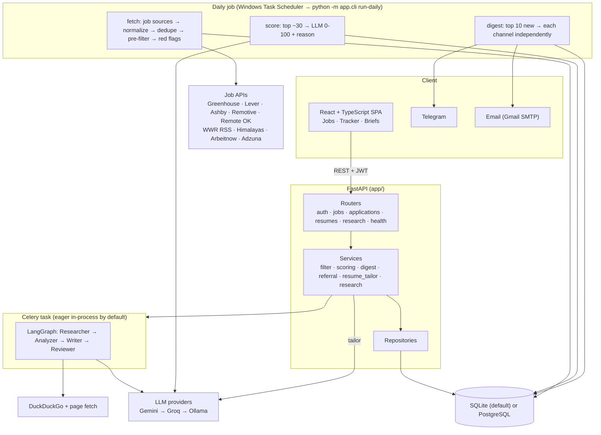
```mermaid
flowchart TB
    subgraph Client
        FE["React + TypeScript SPA<br/>Jobs · Tracker · Briefs"]
        TG["Telegram"]
        MAIL["Email (Gmail SMTP)"]
    end

    subgraph Daily["Daily job (Windows Task Scheduler → python -m app.cli run-daily)"]
        Fetch["fetch: job sources → normalize → dedupe → pre-filter → red flags"]
        Score["score: top ~30 → LLM 0-100 + reason"]
        Digest["digest: top 10 new → each channel independently"]
    end

    subgraph API["FastAPI (app/)"]
        Routers["Routers<br/>auth · jobs · applications · resumes · research · health"]
        Services["Services<br/>filter · scoring · digest · referral · resume_tailor · research"]
        Repos["Repositories"]
    end

    subgraph Worker["Celery task (eager in-process by default)"]
        Pipeline["LangGraph: Researcher → Analyzer → Writer → Reviewer"]
    end

    DB[("SQLite (default) or PostgreSQL")]
    Sources["Job APIs<br/>Greenhouse · Lever · Ashby · Remotive · Remote OK<br/>WWR RSS · Himalayas · Arbeitnow · Adzuna"]
    LLM["LLM providers<br/>Gemini → Groq → Ollama"]
    Search["DuckDuckGo + page fetch"]

    FE -->|"REST + JWT"| Routers --> Services --> Repos --> DB
    Services --> Worker
    Pipeline --> LLM
    Pipeline --> Search
    Fetch --> Sources
    Score --> LLM
    Fetch & Score & Digest --> DB
    Digest --> TG
    Digest --> MAIL
    Services -->|tailor| LLM
```

Everything runs on a Windows laptop with 8 GB RAM and **no Docker**: SQLite by default, Celery in eager
(in-process) mode, and Windows Task Scheduler for the daily run. Docker Compose (Postgres, Redis, a real
worker, MinIO) is still there for anyone who has Docker.

## Tech stack

| Layer | Choice | Why |
|---|---|---|
| Backend | FastAPI, Pydantic v2 | typed contracts, free OpenAPI docs |
| Database | SQLAlchemy 2.0 + Alembic; SQLite or PostgreSQL | versioned migrations; switch by `DATABASE_URL` only |
| Auth | JWT (access + refresh) + bcrypt | stateless; per-user tracker, resumes and briefs |
| AI | LangGraph pipeline; provider-agnostic LLM layer (Gemini → Groq → Ollama) | free-tier friendly with automatic fallback |
| Jobs | public ATS + remote-job APIs via `requests`; RSS via `defusedxml` | legal, free, no scraping; safe XML parsing |
| Notifications | Telegram Bot API, `smtplib` (Gmail App Password) | free; secrets redacted from logs |
| Documents | `fpdf2` (PDF), `python-docx` (DOCX) | ATS-friendly single-column resumes |
| Frontend | React 19 + TypeScript, Vite, TanStack Query, React Router, React Hook Form + Zod | typed end to end |
| UI | Tailwind CSS v4, shadcn/ui-style components (Radix primitives, CVA), lucide icons, Sonner toasts, `react-markdown` + GFM | one token-based design system; light/dark/system themes; LLM output rendered as Markdown with clickable citation chips |
| Quality | ruff, mypy, ESLint, Prettier, pytest, Vitest, forbidden-files check | in CI and pre-commit |

## Project structure

```
app/
  api/routers/      auth · jobs (+ /referral, /brief) · applications · resumes · research · health
  core/             config, security, llm, search, jobsources/, notify, profile, resume, storage
  models/           users, research jobs, jobs, source runs, applications, tailored resumes
  pipeline/         LangGraph research agents
  repositories/     DB access
  schemas/          Pydantic request/response models
  services/         filter, genuineness, ingest, scoring, digest, daily, referral, resume_*, research
  worker/           Celery app + research task
  cli.py            python -m app.cli fetch | refilter | sources | score | digest | test-digest | run-daily
config/
  companies.yaml            ATS watchlist (committed — edit freely)
  profile.example.yaml      copy to profile.yaml (git-ignored)
data/
  master_resume.example.yaml  copy to private/master_resume.yaml (git-ignored)
scripts/
  run_daily.ps1, register_daily_task.ps1   Windows Task Scheduler
  check_forbidden_files.py                 blocks .env / profile / resume / *.db from commits
frontend/src/
  pages/            Jobs, JobDetail, Tracker, NewBrief, Brief, History, Login (landing), Register
  components/       JobBadges, ApplicationEditor, ReferralPanel, ResumePanel, BriefPanel, Markdown, …
  components/ui/    shadcn/ui-style primitives (Button, Card, Badge, Input, Select, Skeleton, …)
  components/layout AppShell (sidebar + mobile drawer), PageHeader, AuthLayout
  theme/            light/dark/system theme provider + toaster
  index.css         design tokens (colors, radii, fonts) for both themes
tests/              pytest (236 tests) — every external API, LLM, Telegram and SMTP call mocked
```

## Setup (Windows, no Docker)

Prerequisites: Python 3.12, Node.js 20+.

### 1. Backend

```powershell
python -m venv venv
venv\Scripts\activate
pip install -r requirements-dev.txt

copy .env.example .env
# Generate a SECRET_KEY and paste it into .env:
python -c "import secrets; print(secrets.token_urlsafe(32))"

alembic upgrade head
uvicorn app.main:app --reload       # API docs: http://127.0.0.1:8000/docs
```

### 2. Frontend

```powershell
cd frontend
npm install
copy .env.example .env               # defaults to http://127.0.0.1:8000
npm run dev                          # http://localhost:5173 — register an account, then log in
```

### 3. Your personal files (never committed)

| File | From | What to put in it |
|---|---|---|
| `.env` | `.env.example` | `SECRET_KEY`, `GEMINI_API_KEY` (free: https://aistudio.google.com/apikey), `GROQ_API_KEY` (free fallback: https://console.groq.com), optional `ADZUNA_APP_ID`/`ADZUNA_APP_KEY` (https://developer.adzuna.com) |
| `config/profile.yaml` | `config/profile.example.yaml` | skills, target roles, cities, college (used by filter, scorer, referral helper) |
| `data/private/master_resume.yaml` | `data/master_resume.example.yaml` | your **real** experience, projects, skills — the tailor can only reorder/reword what's here |

`scripts/check_forbidden_files.py` (pre-commit + CI) refuses commits containing any of these.

### 4. Daily digest setup

**Telegram (free):**
1. In Telegram, message **@BotFather** → `/newbot` → copy the token.
2. Send your new bot any message.
3. Open `https://api.telegram.org/bot<TOKEN>/getUpdates` and copy `message.chat.id`.
4. In `.env`: `DIGEST_TELEGRAM_ENABLED=true`, `TELEGRAM_BOT_TOKEN=…`, `TELEGRAM_CHAT_ID=…`.

**Email (Gmail):**
1. Turn on 2-Step Verification, then create an App Password at https://myaccount.google.com/apppasswords.
2. In `.env`: `DIGEST_EMAIL_ENABLED=true`, `SMTP_USERNAME`, `SMTP_PASSWORD` (the 16-character App
   Password, not your normal password), `DIGEST_EMAIL_FROM`, `DIGEST_EMAIL_TO`.

**Check both:**

```powershell
python -m app.cli test-digest        # sends a sample digest to every configured channel, reports each
```

### 5. Run it every day

```powershell
# once, to try it by hand:
python -m app.cli run-daily          # fetch → score → digest

# schedule it (09:00 daily; runs when you next log in if the laptop was off):
powershell -ExecutionPolicy Bypass -File scripts\register_daily_task.ps1
powershell -ExecutionPolicy Bypass -File scripts\register_daily_task.ps1 -At 08:30   # other time
powershell -ExecutionPolicy Bypass -File scripts\register_daily_task.ps1 -Remove     # undo
```

Output goes to `logs\daily-YYYY-MM.log` (git-ignored; secrets redacted). Other commands:
`python -m app.cli fetch --force`, `refilter` (after editing your profile), `sources`, `score`, `digest`.

### Daily routine

1. Read the digest (Telegram or email) → open promising jobs in the app.
2. On a job: check the red flags → **Save to tracker** → **Generate company brief** if you're serious.
3. **Tailor resume** → review the diff → download PDF → apply on the company's site.
4. Mark **Applied**; use the **Referral helper** to find alumni/engineers and copy a message draft.
5. Follow-ups that fall due show up in the next digest and under **Tracker → Due**.

## Tests and quality checks

```powershell
pytest                                # 236 tests; no API keys or network needed
cd frontend; npm run test             # 60 tests
ruff check . ; ruff format --check . ; mypy app tests
cd frontend; npm run lint; npm run format:check; npm run build
pre-commit run --all-files
```

## Known limitations

- **Free-tier LLM limits.** Scoring is capped at ~30 jobs/run and paced; a company brief uses four LLM
  calls. Gemini as primary avoids most of Groq's 8,000 tokens/minute limit.
- **Sources cover what has a public API.** Many Indian companies only post on LinkedIn/Naukri, which
  this deliberately doesn't touch. Add companies that use Greenhouse/Lever/Ashby to
  `config/companies.yaml`.
- **Red flags and scores are heuristics.** Always verify on the company's official site.
- **Resume tailoring's validator is conservative.** It may reject a harmless rewrite (you keep your
  original wording); it can't judge whether your master resume itself is accurate — that's on you.
- **The Reviewer's citation check** confirms every claim has a valid `[n]`, not that the source truly
  supports it.
- **Not live-verified here:** actual Telegram/Gmail delivery (needs your credentials), Docker Compose,
  and a click-through against a real backend (the screenshots below use the production build with a
  mocked API). Run `test-digest` and click through the app once.
- **Single-user design for the digest** — it goes to the one person who runs the install.

## Screenshots

Production build in a real browser, with a mocked API and fictional companies.

**Landing / login**: one sentence on what the app does, plus the sign-in form.

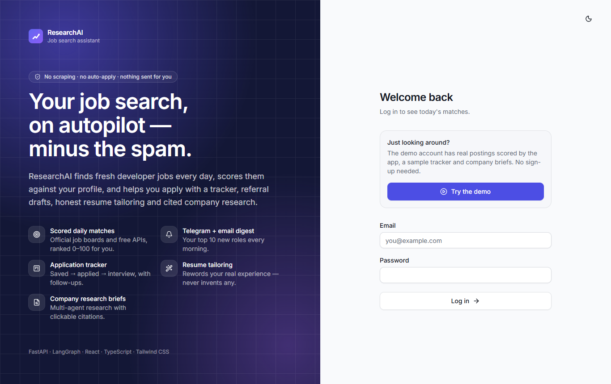

**Jobs**: daily matches with fit scores, source badges, fresher-friendly flags and the AI's reason.

| Light | Dark |
|---|---|
|  | 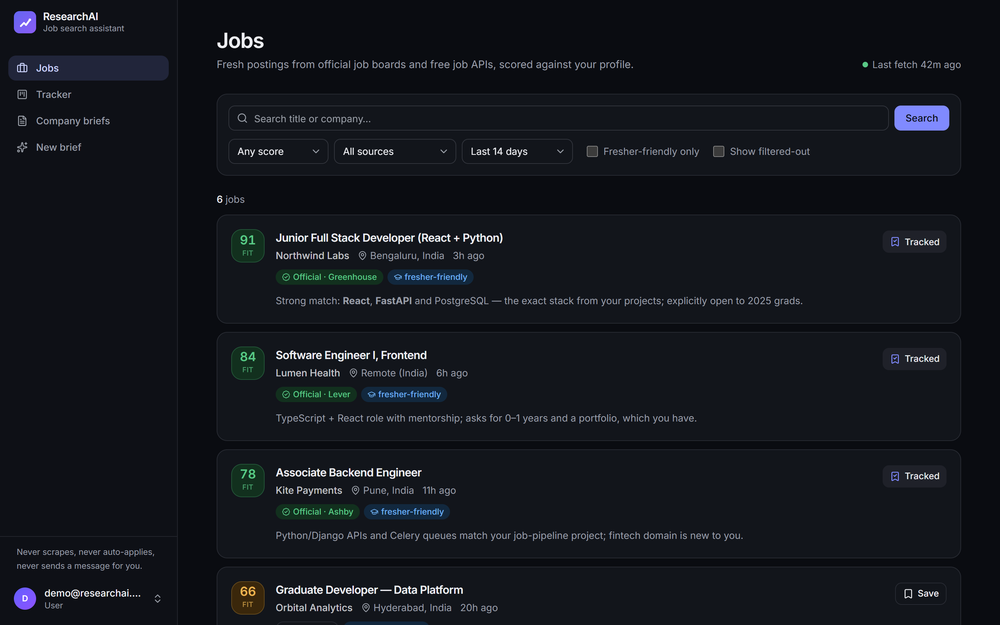 |

**Job page**: why it fits, the description, tailored-resume diff, tracker and company brief.

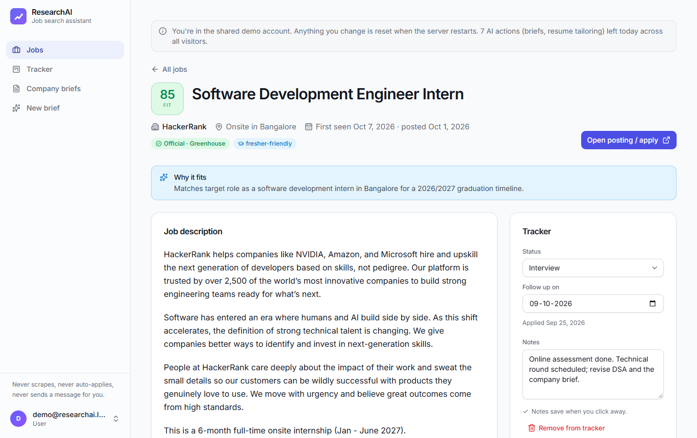

**Application tracker**: status filters with counts, follow-up reminders and notes.

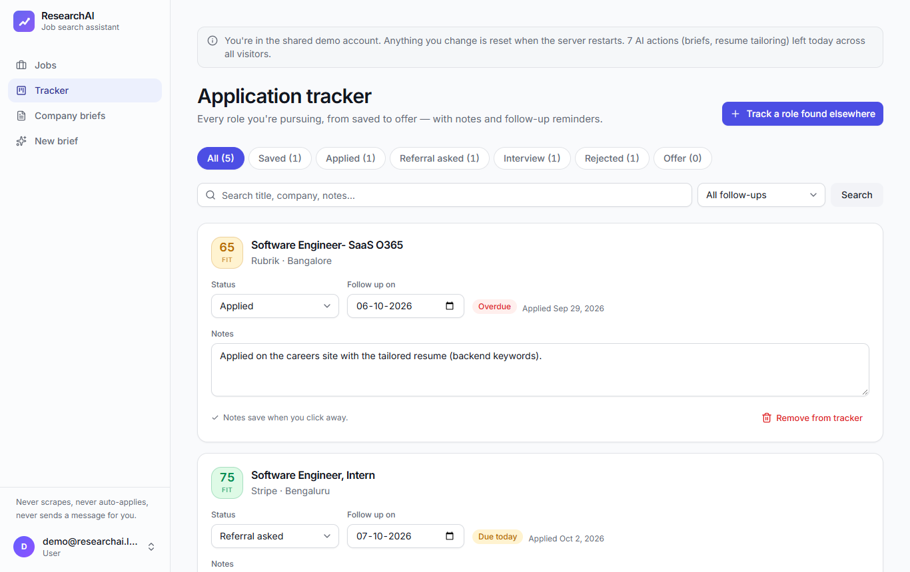

**Company research brief**: the LLM report rendered as Markdown; each `[n]` citation is a chip that
opens its source.

| Light | Dark |
|---|---|
| 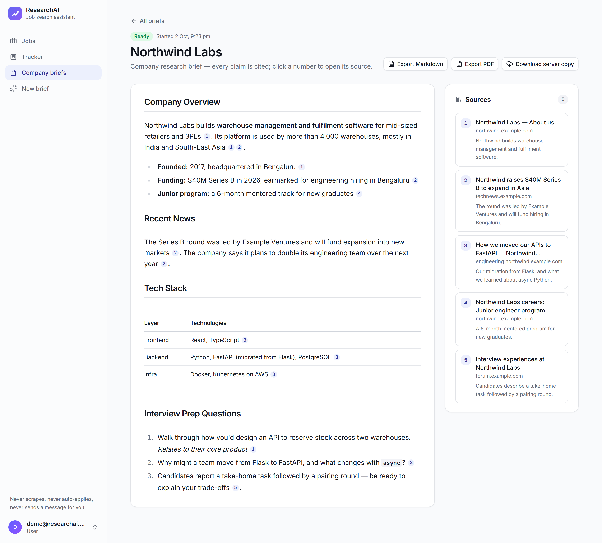 | 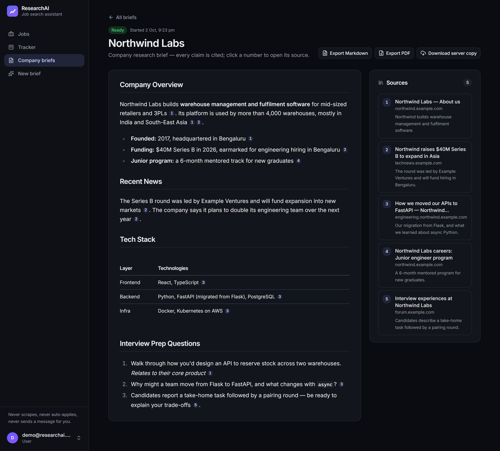 |

**Briefs history** and **mobile** (responsive layout with a slide-out navigation drawer):

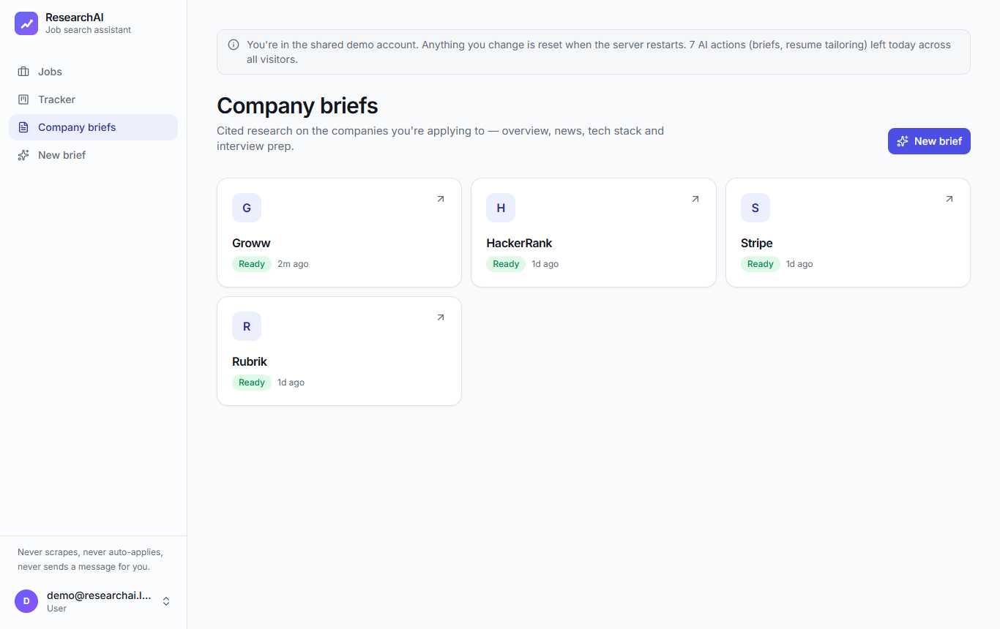

| Mobile | Mobile navigation |
|---|---|
| 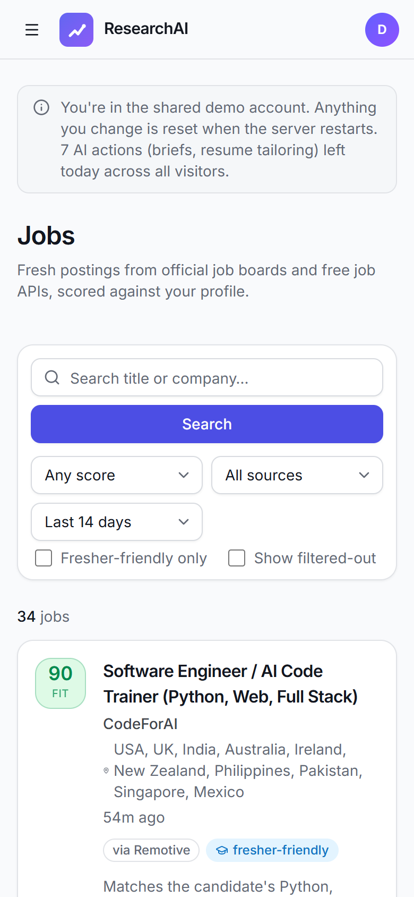 | 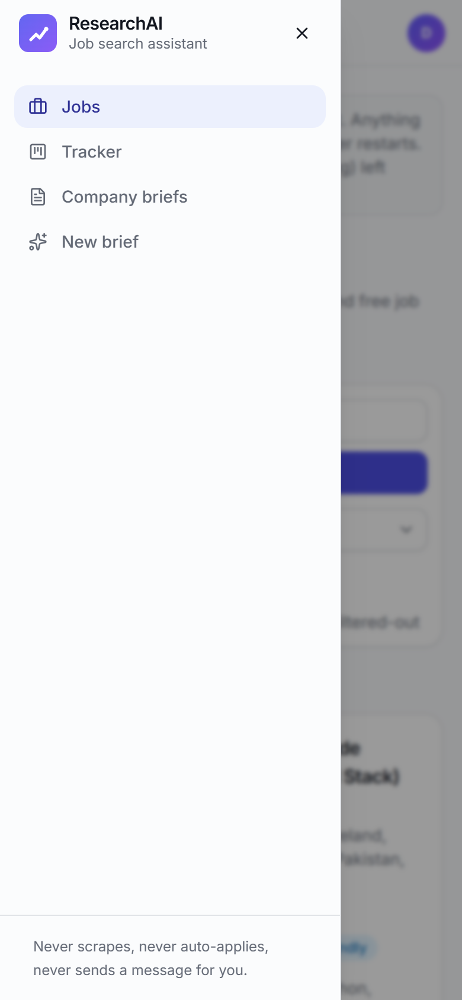 |
