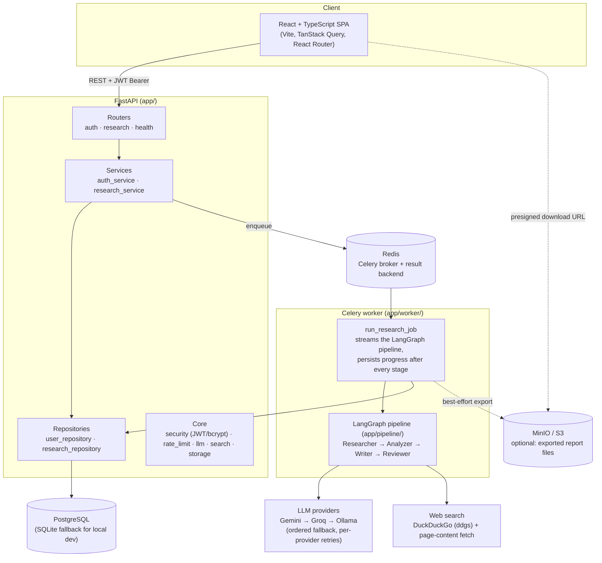

# ResearchAI — Company Research Brief

A multi-agent pipeline that researches a company via live web search and produces a sourced, cited
brief: company overview, recent news, tech stack, and interview prep questions. Built as a
production-style rebuild of a personal project — see [`docs/DECISIONS.md`](docs/DECISIONS.md) for the
full phase-by-phase engineering log, including how to
talk about it.

## What it does

Enter a company name. Four pipeline stages run in sequence, each persisted to the database as it
completes so the UI can show live progress:

1. **Researcher** — searches the web (DuckDuckGo), fetches and extracts page content, and asks an LLM
   to synthesize research notes with a numbered citation (`[1]`, `[2]`, ...) on every claim.
2. **Analyzer** — organizes the research into four sections: Company Overview, Recent News, Tech
   Stack, Interview Prep Questions — preserving citations.
3. **Writer** — produces the final formatted brief, plus a Sources section.
4. **Reviewer** — fact-checks the draft against the source list, flagging any claim with a missing or
   invalid citation in a "Verification Notes" section.

The result is persisted, versioned by status (`researching` → `analyzing` → `writing` → `done`, or
`failed` with an error message), and retrievable by anyone who has access to it — not just the person
who ran it.

## Architecture


```mermaid
flowchart TB
    subgraph Client
        FE["React + TypeScript SPA<br/>(Vite, TanStack Query, React Router)"]
    end

    subgraph API["FastAPI (app/)"]
        Routers["Routers<br/>auth · research · health"]
        Services["Services<br/>auth_service · research_service"]
        Repos["Repositories<br/>user_repository · research_repository"]
        Core["Core<br/>security (JWT/bcrypt) · rate_limit · llm · search · storage"]
    end

    subgraph Worker["Celery worker (app/worker/)"]
        Task["run_research_job<br/>streams the LangGraph pipeline,<br/>persists progress after every stage"]
        Pipeline["LangGraph pipeline (app/pipeline/)<br/>Researcher → Analyzer → Writer → Reviewer"]
    end

    DB[("PostgreSQL<br/>(SQLite fallback for local dev)")]
    Redis[("Redis<br/>Celery broker + result backend")]
    Storage[("MinIO / S3<br/>optional: exported report files")]

    LLM["LLM providers<br/>Gemini → Groq → Ollama<br/>(ordered fallback, per-provider retries)"]
    Search["Web search<br/>DuckDuckGo (ddgs) + page-content fetch"]

    FE -->|"REST + JWT Bearer"| Routers
    Routers --> Services
    Services --> Repos
    Repos --> DB
    Services -->|enqueue| Redis
    Redis --> Task
    Task --> Pipeline
    Pipeline --> LLM
    Pipeline --> Search
    Task --> Repos
    Task -.->|best-effort export| Storage
    FE -.->|presigned download URL| Storage
```

**Why this shape:** the API never runs the LLM pipeline inline — `POST /research` creates a job row and
hands it to a Celery task, returning immediately (`202 Accepted`). The frontend polls
`GET /research/{id}` and watches `status` advance through each stage. Locally (no Redis in most dev
setups), Celery runs in **eager mode** — the same task code executes synchronously in-process, so
everything still works without extra infrastructure; `docker-compose` flips this to a real background
worker. See `docs/DECISIONS.md` (Phase 5) for details.

## Tech stack

| Layer | Choice | Why |
|---|---|---|
| Backend | FastAPI, Pydantic v2 | async-friendly, typed request/response contracts, free OpenAPI docs |
| Database | PostgreSQL + SQLAlchemy 2.0 + Alembic | real relational DB with versioned schema migrations |
| Auth | JWT (access + refresh) + bcrypt | industry-standard stateless auth; no session store needed |
| Async jobs | Celery + Redis | decouples slow LLM calls from the request/response cycle |
| AI orchestration | LangGraph | explicit state machine for a multi-stage agent pipeline, with per-stage persistence via `.stream()` |
| LLM providers | Gemini (primary) → Groq (fallback) → Ollama (optional, local) | free-tier friendly, with automatic fallback on rate limits/outages |
| Web search | DuckDuckGo (`ddgs`), `trafilatura` for content extraction | free, no API key, grounds the pipeline in real sources instead of model recall |
| Object storage | MinIO (S3-compatible) via `boto3` | optional; same code works against real AWS S3 |
| Frontend | React 19 + TypeScript, Vite, TanStack Query, React Router, React Hook Form + Zod | typed contracts end-to-end, server-state-aware data fetching |
| Quality | ruff, mypy, ESLint, Prettier, pytest, Vitest | enforced in CI and pre-commit, not just locally |
| Infra | Docker, docker-compose, GitHub Actions | reproducible local stack; CI needs no secrets or real infra (everything's mocked/eager) |

## Project structure

```
app/
  api/            FastAPI routers + auth dependency
  core/            config, security, llm (provider factory), search, storage, rate_limit, middleware
  models/          SQLAlchemy ORM models
  pipeline/        LangGraph agents + graph + web-sourcing
  repositories/     DB access layer
  schemas/         Pydantic request/response models
  services/        orchestration layer between routers and pipeline/worker
  worker/          Celery app + the research-job task
alembic/           database migrations
frontend/
  src/api/          typed fetch client + hand-written types
  src/auth/        auth context + hook
  src/components/   ProgressStages, SourceList, ExportButtons, ProtectedRoute
  src/pages/       Login, Register, NewBrief, Brief (polling), History
tests/             pytest suite (56 tests) — all LLM/search calls mocked
docs/
  DECISIONS.md     phase-by-phase engineering log (the "why" behind every choice)
```

## Setup

### Prerequisites

- Python 3.12
- Node.js 20+
- (Optional) Docker + Docker Compose, for the full containerized stack

### 1. Get a free LLM API key

The pipeline needs at least one configured provider. **Gemini is recommended as primary** — its free
tier is more generous than Groq's for a 4-stage pipeline (see `docs/DECISIONS.md` Phase 2 for why).

- Gemini (free): https://aistudio.google.com/apikey
- Groq (free, fallback): https://console.groq.com

### 2. Backend

```bash
python -m venv venv
source venv/bin/activate        # Windows: venv\Scripts\activate
pip install -r requirements-dev.txt

cp .env.example .env
# edit .env: add GEMINI_API_KEY and/or GROQ_API_KEY,
# and generate a real SECRET_KEY:
python -c "import secrets; print(secrets.token_urlsafe(32))"

alembic upgrade head
uvicorn app.main:app --reload
```

API docs: http://127.0.0.1:8000/docs

### 3. Frontend

```bash
cd frontend
npm install
cp .env.example .env            # defaults to http://127.0.0.1:8000, fine for local dev
npm run dev
```

App: http://localhost:5173

### 4. Or: the full stack via Docker

```bash
cp .env.example .env            # add your LLM key(s) here too — docker-compose reads this file
docker compose up --build
```

This also starts Postgres, Redis, a real Celery worker, and MinIO. Not verified live in this
environment (no Docker available while building it — see `docs/DECISIONS.md` Phase 7) — **please run
this once to confirm** before relying on it.

### Running tests

```bash
# backend
pytest -v                       # 56 tests, all LLM/search calls mocked — no API key needed

# frontend
cd frontend && npm run test     # 16 tests
```

### Quality checks

```bash
ruff check app tests && ruff format --check app tests && mypy app tests
cd frontend && npm run lint && npm run format:check
pre-commit run --all-files      # runs all of the above, plus whitespace/large-file checks
```

## Known limitations

- **Groq's free tier (8000 tokens/minute) can be tight** for a 4-stage pipeline with rich source
  content on Groq alone — add a Gemini key as primary to avoid this in practice. The app handles the
  rate limit gracefully (retries, clear error message, partial progress preserved) either way.
- **The Reviewer's "fact-check" is an LLM self-review**, not a formal verifier — it catches citation
  bookkeeping errors (a claim with no `[n]` or an invalid one) but doesn't verify that a cited source
  *actually supports* the claim's content.
- **Docker and MinIO were not live-verified** in the environment this was built in (no Docker
  available) — the code and config are correct by inspection and unit-tested, but `docker compose up`
  should be run once to confirm end-to-end.

See `docs/DECISIONS.md` for the full, phase-by-phase reasoning behind every design choice, and
`docs/DECISIONS.md` for the reasoning behind each choice.

## Screenshots

Not included — this was built and verified via API-level testing (`pytest`, `curl`, live CORS/auth
round-trips) rather than a browser session. Run the app locally and it's worth
adding a few here (new brief → progress view → final report with citations → history) before sharing
this as a portfolio piece.
